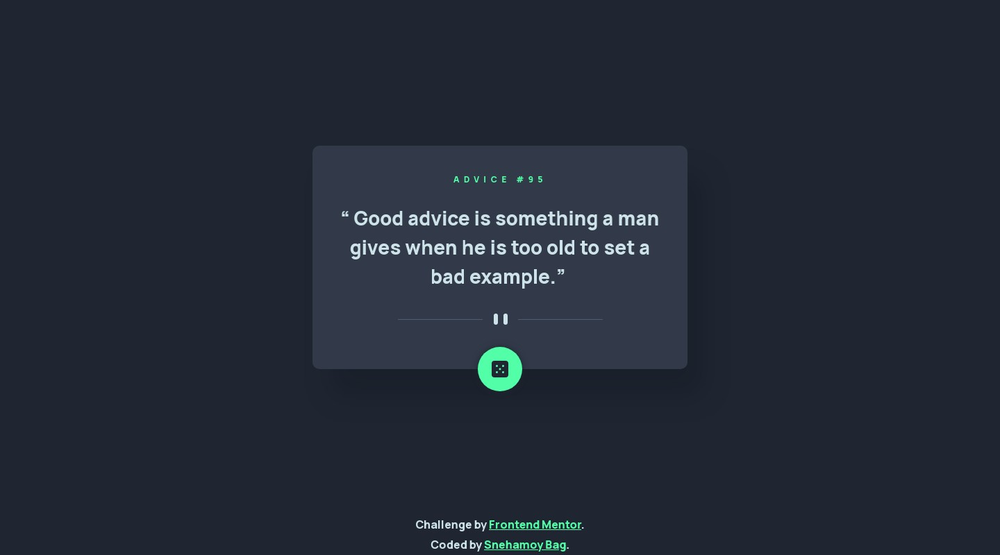
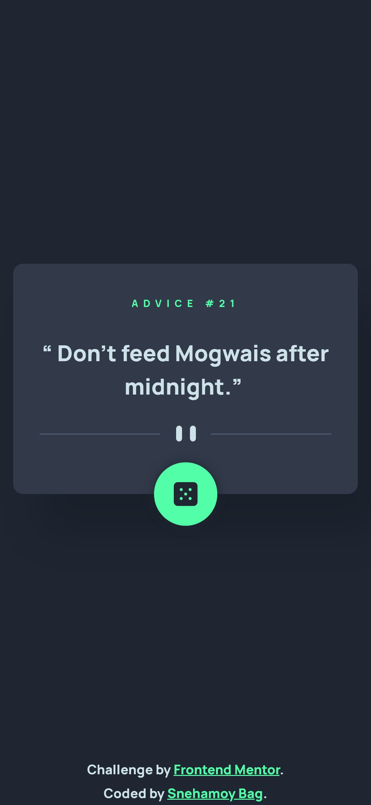

# Frontend Mentor - Advice generator app solution

This is a solution to the [Advice generator app challenge on Frontend Mentor](https://www.frontendmentor.io/challenges/advice-generator-app-QdUG-13db). Frontend Mentor challenges help you improve your coding skills by building realistic projects.

## Table of contents

- [Overview](#overview)
- [The challenge](#the-challenge)
- [Screenshot](#screenshot)
- [Links](#links)
- [My process](#my-process)
- [Built with](#built-with)
- [What I learned](#what-i-learned)
- [Continued development](#continued-development)
- [Useful resources](#useful-resources)
- [Author](#author)

## Overview

### The challenge

Users should be able to:

- View the optimal layout for the app depending on their device's screen size
- See hover states for all interactive elements on the page
- Generate a new piece of advice by clicking the dice icon

### Screenshot

### Links

- Solution URL: [View](https://github.com/snehamoybag/fem-advice-generator)
- Live Site URL: [View](https://snehamoybag.github.io/fem-advice-generator/)

## My process

### Built with

- Semantic HTML5 markup
- BEM naming convention
- CSS custom properties
- CSS Grid
- Javascript
- Advice Slip API
- Mobile-first workflow

### What I learned

Before taking on this challenge I had no Idea what asynchronous programing was as I've never worked with API ever.
Hence, I had to lookup some MDN docs and had to watch some Fetch API tutorials on Youtube.
Fair to say I was a little confused about the asynchronous behavior of Javascript at first.
Therefor, I had to spend about 3 days Learning - javascript call backs, promises and async/await, fetch API and how to write custom Header(s) for some APIs.
Had plenty of fun tryingout different APIs to do fun stuffs!

This challenge definitly helped me upscale and improve my knowledge about javascript.

### Continued development

The app is very barebones/basic, it generates a new Advice on a button click. Which it supposed to do!
But in near future I'd like to add some loading animation in between the data fetching interval.
Also fix a bug where, if you tap the button continuously, it does some weired stufs..like flickering!

### Useful resources

- [Synchronous vs Asynchronous JavaScript](https://www.freecodecamp.org/news/synchronous-vs-asynchronous-in-javascript/) - A great article by Tapas Adhikary about Asynchronous behavior of Javascript. A MUST READ!
- [Javascript Promises](https://developer.mozilla.org/en-US/docs/Web/JavaScript/Reference/Global_Objects/Promise) - Our beloved MDN Docs on Javascript Promises.
- [Javascript async/await](https://developer.mozilla.org/en-US/docs/Web/JavaScript/Reference/Statements/async_function) - Again Our trusty and beloved MDN Docs for the rescue!

## Author

- Github Profile - [@snehamoybag](https://github.com/snehamoybag/)
- Frontend Mentor - [@snehamoybag](https://www.frontendmentor.io/profile/snehamoybag)
- LinkedIn - [@Snehamoy Bag](https://in.linkedin.com/in/snehamoy-bag-a83509238)